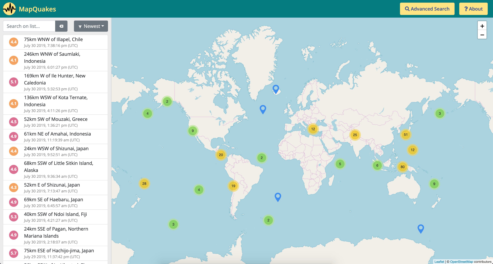

# mapquakes
An interactive map for earthquakes :volcano:

This is an app i made for fun. It is built mainly with React, Redux, Reactstrap and leaflet.
The data for the earthquakes are from the USGS API.

Visit the app [here](https://awesome-darwin-70b3f1.netlify.com/)

